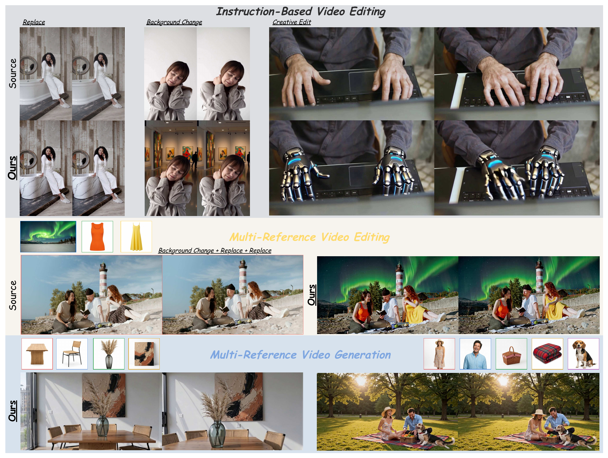
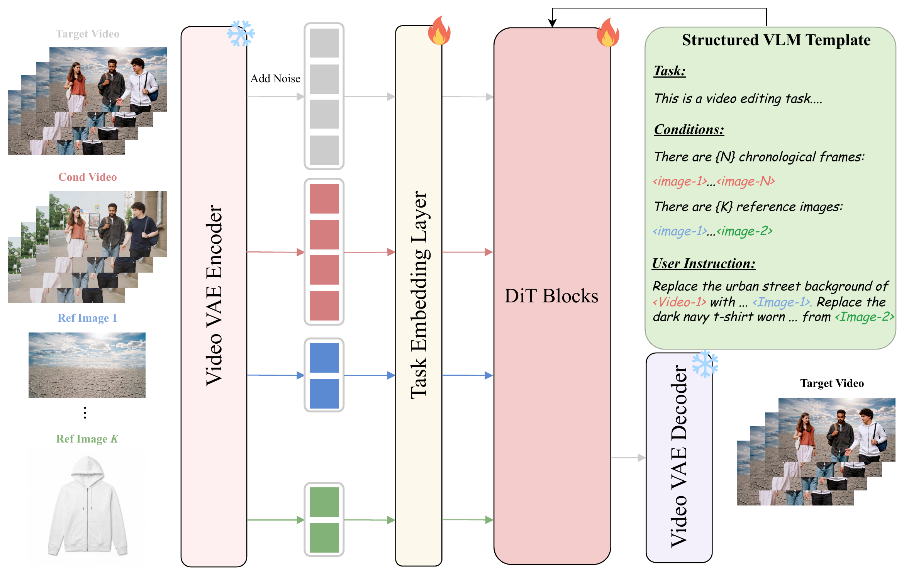

  

<h1 align="center">TIDE: Unified Video Editing and Generation via Per-Token Task Embeddings</h1>

  &emsp;
  &emsp;
  

---

## Abstract

Recent advances in Diffusion Transformers have driven rapid progress in video generation and editing, yet these capabilities are still handled by separate, task-specific models. Building a unified framework that supports diverse video tasks remains an open challenge: existing unified attempts either require dedicated auxiliary encoders or lack explicit mechanisms to distinguish heterogeneous conditioning tokens, struggling when the number and type of visual conditions vary across tasks. We propose **TIDE**, a unified framework that integrates instruction-based editing, reference-guided editing, and multi-reference generation. At its core, we introduce **per-token task embeddings** that assign each input token a task-specific identifier, enabling the model to explicitly disambiguate target, source, and reference tokens. To simultaneously capture high-level semantic understanding and fine-grained structural fidelity, we design a **dual-path conditioning scheme** that couples a vision-language model with a VAE latent path for complementary signals. We further devise a **multi-task progressive training strategy** that incrementally introduces tasks of increasing complexity, effectively harmonizing diverse objectives and enabling smooth generalization across heterogeneous task distributions. Extensive experiments on multiple video editing and generation benchmarks demonstrate that TIDE achieves state-of-the-art performance across all evaluated tasks.

## Method

  

## Results

### OpenVE-Bench (Instruction Editing)

| Method | Style | BG | Chg | Rm | Add | Sub | Cre | Cam | **Avg** |
|--------|:-----:|:--:|:---:|:--:|:---:|:---:|:---:|:---:|:-------:|
| Kling-O1† | 4.32 | 2.44 | 4.01 | 3.03 | 2.89 | 3.12 | 3.44 | 3.75 | 3.36 |
| SkyReels-Omni† | 4.41 | 2.23 | 4.19 | 3.35 | 2.36 | 3.62 | 3.44 | 1.23 | 3.14 |
| VINO | 4.31 | 1.50 | 2.94 | 2.38 | 2.07 | 2.78 | 2.63 | **2.22** | 2.60 |
| **TIDE (Ours)** | **4.32** | **2.62** | **3.54** | **2.68** | **2.18** | **3.56** | **2.93** | 1.15 | **2.91** |

### TIDE-Bench (Multi-Reference Editing)

| Method | Edit | Ref | V&T | Pres | Qual | **Overall** |
|--------|:----:|:---:|:---:|:----:|:----:|:-----------:|
| SkyReels-Omni† | 4.29 | 4.01 | 3.58 | 3.63 | 3.53 | **3.81** |
| Kling-O1† | 4.09 | 3.78 | 3.43 | 3.47 | 3.40 | 3.63 |
| **TIDE (Ours)** | **4.07** | **3.44** | **3.20** | **3.21** | **3.15** | **3.41** |
| VINO | 3.05 | 2.73 | 2.27 | 2.14 | 2.07 | 2.45 |

### OpenS2V (Subject-to-Video Generation)

| Method | Total | Aes | MSmooth | MAmp | GME | Nexus | Natural |
|--------|:-----:|:---:|:-------:|:----:|:---:|:-----:|:-------:|
| **TIDE (Ours)** | **62.62** | **49.53** | 95.84 | 22.56 | 70.09 | **49.40** | **73.66** |
| Kling 1.6† | 60.26 | 44.59 | 86.93 | 41.60 | 66.20 | 45.89 | 74.59 |
| VINO | 59.31 | 45.92 | 94.73 | 12.30 | 69.69 | 42.67 | 71.99 |
| Phantom-14B | 58.10 | 46.39 | 96.31 | **33.42** | 70.65 | 37.43 | 69.35 |
| VACE-14B | 58.16 | 47.21 | 94.97 | 15.02 | 67.27 | 44.08 | 67.04 |
| MagRef | 57.94 | 45.02 | 93.17 | 21.81 | 70.47 | 43.04 | 66.90 |
